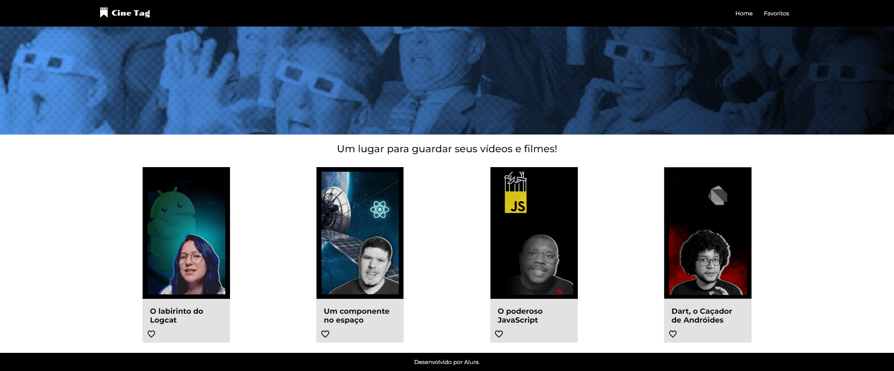
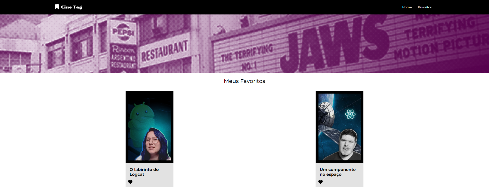

# Projeto Cinetag

Projeto desenvolvido durante o curso de React: praticando React com Js

# Principais tecnologias utilizadas no projeto
* React
* NodeJs
* React-Router-DOM
* ContextAPI

# Imagens do projeto

Imagem da pagina inicial

Imagem da pagina contendo o player de video

Imagem da pagina com os favoritos